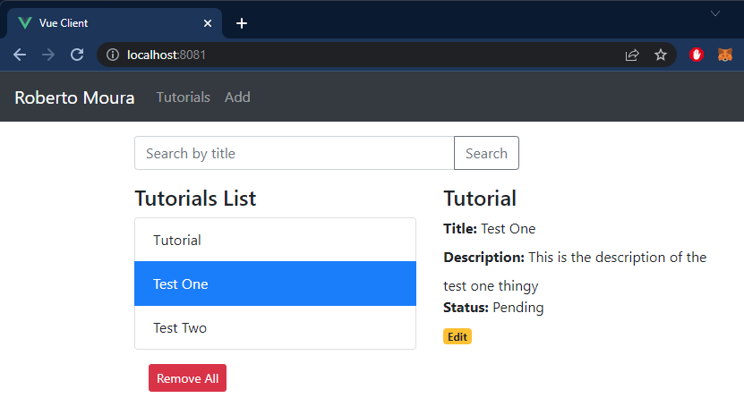

# Vue 3 example with Axios & Vue Router: Build CRUD App
Build a Vue.js 3 CRUD example to consume REST APIs, display and modify data using Axios and Vue Router.
- Each Tutorial has id, title, description, published status.
- We can create, retrieve, update, delete Tutorials.
- There is a Search bar for finding Tutorials by title.



## How To Run
Alter the url on the file ".server/config/db.config.js" to your own mongodb user and password:
```
"mongodb+srv://mongouser:<password>@cluster0.lz21f1y.mongodb.net/?retryWrites=true&w=majority"
```
## Project setup
```
npm install
```

### Compiles and hot-reloads for development
```
npm run serve
```

### Compiles and minifies for production
```
npm run build
```

### Run your tests
```
npm run test
```

### Lints and fixes files
```
npm run lint
```

## Endpoints on the Back-End
Methods	    Urls	                        Actions
- POST	    /api/tutorials	                create new Tutorial
- GET	    /api/tutorials	                retrieve all Tutorials
- GET	    /api/tutorials/:id	            retrieve a Tutorial by :id
- PUT	    /api/tutorials/:id	            update a Tutorial by :id
- DELETE	/api/tutorials/:id	            delete a Tutorial by :id
- DELETE	/api/tutorials	                delete all Tutorials
- GET	    /api/tutorials?title=[keyword]	find all Tutorials which title contains keyword

# Technology
- vue: 2.6.10
- vue-router: 3.1.3
- axios: 0.19.0

# Description
- package.json contains 3 main modules: vue, vue-router, axios.
- There are 3 components: TutorialsList, Tutorial, AddTutorial.
- router.js defines routes for each component.
- http-common.js initializes axios with HTTP base Url and headers.
- TutorialDataService has methods for sending HTTP requests to the Apis.
- vue.config.js configures port for this Vue Client.
